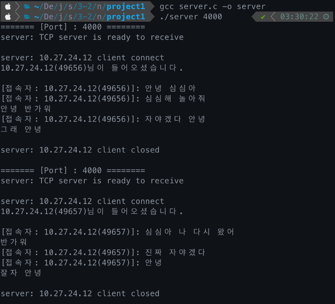

# [과제 1] TCP 소켓 프로그래밍

> 목표

- TCP 소켓 프로그래밍을 이용한 간단한 응용 계층 프로그램 실습

 

> 구현 프로그램

- 간단한 온라인 챗봇 유사 프로그램 작성
- 사용자(client)는 채팅방(server)에 접속하여 서버와 대화 가능
- 사용자가 채팅 종료를 원할 때 'quit' 입력하면 서버와 연결 끊어짐

 

> 결과 화면
1. port 4000에 서버 오픈

2. client가 server에 접속

- client 화면

- server 화면

3. client와 server 간의 대화

- client 화면

- server 화면

 

> source
- [server](https://github.com/junghyun21/soongsilUniv/blob/main/3-2_fall2022/network/project1/server.c)
- [client](https://github.com/junghyun21/soongsilUniv/blob/main/3-2_fall2022/network/project1/client.c)