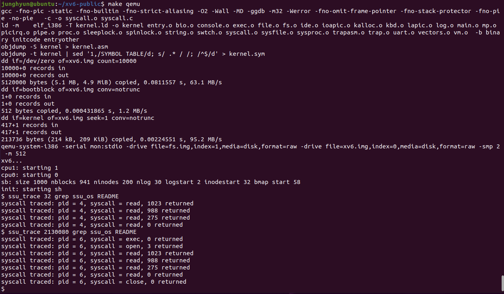

# [과제 2] xv6에 새로운 시스템 호출 추가

> 목표

- xv6에 새로운 시스템콜 추가

 

> 세부사항

- memsize() 시스템 콜 추가 및 이를 호출하는 간단한 쉘 프로그램 구현
- trace 시스템 콜 추가 및 이를 호출하는 간단한 쉘 프로그램 구현

 
 

## 기본 지식

> 시스템 콜이 호출되는 방법

- 인자 없이 정수 값만 리턴
    - sysproc.c 내 구현된 `uptime()`
        - interrupt가 발생된 횟수 리턴
        - [source](https://github.com/mit-pdos/xv6-public/blob/eeb7b415dbcb12cc362d0783e41c3d1f44066b17/sysproc.c#L82)
- 문자열 및 정수 등의 인자를 받아 정수 값 리턴
    - sysfile.c 내 구현된 `open()`
        - [source](https://github.com/mit-pdos/xv6-public/blob/eeb7b415dbcb12cc362d0783e41c3d1f44066b17/sysfile.c#L286)
    - syscall.c 내에 인자를 받는 함수들 구현되어 있음
        - [source](https://github.com/mit-pdos/xv6-public/blob/eeb7b415dbcb12cc362d0783e41c3d1f44066b17/syscall.c#L49)
- 여러 정보를 사용자가 정의한 구조체로 리턴
    - sysfile.c 내 구현된 `fstat()`
        - `filestat(struct file *f, struct stat *st)` : f에 대한 메타데이터를 가져옴
        - [source](https://github.com/mit-pdos/xv6-public/blob/eeb7b415dbcb12cc362d0783e41c3d1f44066b17/sysfile.c#L107)

 

> xv6 커널 이해

시스템 콜을 추가하기 위해서는 `proc.c`, `proc.h`, `syscall.c`, `syscall.h`, `sysproc.c`, `user.h`, `usys.S` 수정 필요

- proc.c
    - process 간의 scheduling 및 context 전환을 수행하는 함수 구현
        - `scheduling`: 다중 프로그래밍을 가능하게 하는 운영 체제의 동작 기법으로 자원을 어떻게, 누구에게 할당할 지 결정하는 작업
        - `context switch`: 다른 프로세스가 CPU를 사용하기 위해, 현재 프로세스의 정보(Context)를 저장하고 새로운 프로세스의 정보를 CPU에 적재하는 작업
    - [source](https://github.com/mit-pdos/xv6-public/blob/master/proc.c)
- proc.h
    - 구조체 `proc`의 구조 정의
    - `proc`는 각 process의 상태 정보를 담고 있음
    - [source](https://github.com/mit-pdos/xv6-public/blob/master/proc.h)
- syscall.c
    - 시스템 콜 인수를 구문 분석하는 함수
    - 실제 시스템 콜 구현에 대한 포인터
    - `extern`: 선언된 전역 변수 및 함수가 외부 소스 파일에 존재함을 의미
    - [source](https://github.com/mit-pdos/xv6-public/blob/master/syscall.c)
- syscall.h
    - 시스템 콜 번호 mapping
    - 새로운 시스템 콜을 위해 새로운 mapping을 추가해줘야 함
    - [source](https://github.com/mit-pdos/xv6-public/blob/master/syscall.h)
- sysproc.c
    - process 관련 시스템 콜 구현
    - 이 파일에서 시스템 콜의 코드 구현
    - [source](https://github.com/mit-pdos/xv6-public/blob/master/sysproc.c)
- user.h
    - xv6 시스템 콜 정의
    - [source](https://github.com/mit-pdos/xv6-public/blob/master/user.h)
- usys.S
    - xv6 시스템 콜 리스트
    - `.S` 확장자: 개발자가 직접 작성한 어셈블리어 코드로 전처리가 필요한 파일
    cf) `.s` 확장자: 순수하게 어셈블리어로만 작성되어 있어 전처리가 필요 없음
    - [source](https://github.com/mit-pdos/xv6-public/blob/master/usys.S)

 
 

## memsize 시스템 콜

> memsize() 구현

- 호출한 프로세스의 메모리 사용량을 출력
- 기존 코드 수정 필요
    - `usys.S`: 시스템 콜 리스트 내에 memsize 추가
    - `user.h`: memsize 시스템 콜 선언 추가
    - `syscall.c`: 시스템 콜 구현에 대한 포인터 및 extern 함수 추가
    - `syscall.h`: 시스템 콜과 번호 mapping 추가
    - `sysproc.c`: memsize 시스템 콜 구현 코드 추가
- memsizetest라는 쉘 프로그램 구현 통해 memsize()의 실행 결과 확인
    - xv6가 실행될 때 memsizetest.c도 컴파일이 될 수 있도록 Makefile 수정 필요
- [source](https://github.com/junghyun21/soongsilUniv/tree/main/3-2_fall2022/os/project2/sys_memsize)
    
    

 
 

## trace 시스템 콜

> trace() 구현

- 인자로 받은 시스템 콜을 추적함으로써 디버깅 시 도움을 줌
- 추적할 시스템 콜을 지정하는 정수 [mask]를 인자로 받음
    - read 시스템 콜 추적 → 사용자 프로그램은 `trace(1 << SYS_read)` 호출
    - SYS_read는 syscall.h에 정의되어 있는 시스템 콜 번호인 5
    - 즉, mask 값이 32(1 << 5)라면 read 시스템 콜 추적함
- 추적해야 하는 각 시스템 콜 리턴 시, 프로세스 아이디, 시스템 콜 이름, 리턴 값 출력
- trace() 시스템 콜은 호출한 프로세스와 이후 생성(fork)하는 모든 자식 프로세스에 대한 trace mask 활성화 해야하며, 다른 프로세스에는 영향을 미치면 안됨
- 기존 코드 수정 필요
    - `proc.h`: process에 대한 추가 정보를 추적(trace)하기 위해 proc의 구조 변경 필요
    → 마스크를 위한 변수 추가
    - `proc.c`: 자식 생성 시 mask를 전달하기 위해 fork() 수정
    → fork() 호출 시, 즉 자식 프로세스 생성 시 마스크 값을 자식 프로세스에게 전달
    → static struct proc * allcproc(void) 내에서 마스크 값 0으로 초기화
    - `usys.S`: 시스템 콜 리스트 내에 trace 추가
    - `user.h`: trace 시스템 콜 정의 추가
    - `syscall.c`: 시스템 콜 구현에 대한 포인터 및 extern 함수 추가 및 syscall 함수 수정
    - `syscall.h`: 시스템 콜과 번호 mapping 추가
    - `sysproc.c`: trace 시스템 콜 구현 코드 추가
    → 마스크 값을 인자로 받고, 호출한 프로세스의 마스크 값을 설정
- ssu_trace 라는 쉘 프로그램 구현 통해 trace()의 실행결과 확인
    - `ssu_trace [mask] [command]`
        - [mask]: 시스템 콜을 추적하기 위한 비트 집합
        - [command]: 해당 명령어가 호출하는 시스템 콜을 추적
    - xv6가 실행될 때 ssu_trace.c도 컴파일이 될 수 있도록 Makefile 수정 필요
- [source](https://github.com/junghyun21/soongsilUniv/tree/main/3-2_fall2022/os/project2/sys_trace)
    
    
