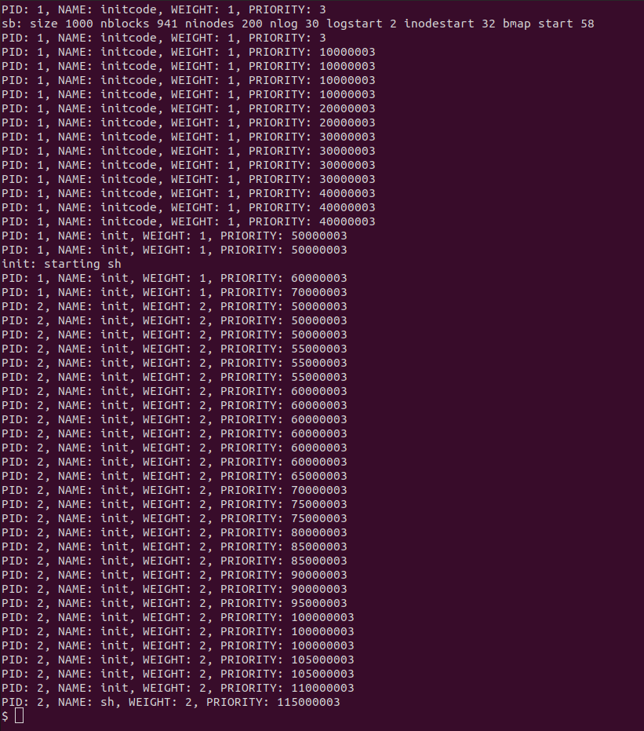

# [과제 2] xv6의 기존 스케줄링 기법 변경

> 목표

- xv6의 프로세스 관리 및 스케줄링 기법 이해
- xv6에서 기존 스케줄러 변경 및 명령어 추가

 

> 세부사항

- xv6의 기존 scheduler를 변경하여 SSU Scheduler 구현
- 구현한 스케쥴링 함수의 동작 과정을 확인하는 sdebug 명령어 및 이를 위한 weightset() 시스템콜 구현
- 다음에 실행될 프로세스 선정 과정 및 디버깅 기능 구현

 
 

## 기본 지식

> Scheduling

- CPU는 하나의 프로세스 작업이 끝나면 다음 프로세스 작업 수행
- 다음 프로세스를 선택하는 알고리즘을 CPU Scheduling 이라고 함
- CPU Scheduler
    - 실행 준비가 되어 있는 프로세스 중에서 하나를 선택하여 CPU에게 할당함

 

> xv6의 기존 scheduler
- Round-Robin Scheduling 기법에 의존
- 프로세스들 사이에 우선 순위를 두지 않고 순서대로 시간단위로 CPU를 할당하는 방식
- 즉 기본적으로 실행할 수 있는 모든 프로세스를 반복시키는 방식
- [source](https://github.com/mit-pdos/xv6-public/blob/eeb7b415dbcb12cc362d0783e41c3d1f44066b17/proc.c#L322)

 
 

## SSU Scheduler

> SSU Scheduler
- 우선순위가 높은 프로세스부터 실행되는 방식
    - 각각의 프로세스들이 가중치(weight)와 우선순위(priority)를 가지고 있음
    - 가중치에 의해 우선순위 결정됨
    - 프로세스 실행 흐름에서 새로 생긴 프로세스가 제외되지 않도록 생성 순서에 따라 가중치를 1부터 차례대로 증가시키며 부여함
    - new_priority = old_priority + (time_slice / weight)
- 프로세스들은 각각 time_slice 동안만 실행 가능
- 시스템 시작 시 총 세 개의 user process(initcode, init, sh)가 생성되므로, 최소 priority 값을 3으로 지정
- 본 과제는 CPU 코어 개수를 1개로 제어함 (Makefile 수정 필요)

 

> SSU Scheduler 구현

SSU Scheduler를 구현하기 위해서 `proc.h`, `proc.c`, `defs.h` 수정 필요

- `proc.h`
    - [source](https://github.com/mit-pdos/xv6-public/blob/master/proc.h)
    - 구조체 `proc`에 우선순위와 가중치를 나타내는 멤버 변수 추가
- `proc.c`
    - [source](https://github.com/mit-pdos/xv6-public/blob/master/proc.c)
    - SSU Scheduler 구현 부분을 포함하도록 `void scheduler(void)` 수정
    - 우선순위 값 중 가장 작은 값을 저장하는 멤버 변수 추가한 형태로 `struct ptable` 수정
    - 현재 우선순위 값을 기반으로 새로운 우선순위 값을 할당해주는 `void update_priority(struct proc *proc)` 추가
    - ptable의 멤버변수인 min_priority(우선순위 중 가장 작은 값)를 업데이트해주는 `void update_min_priority(void)` 추가
    - 새로 생성되거나 wake up된 프로세스에게 가장 작은 값의 우선 순위를 부여하는 `void assign_min_priority(struct proc *proc)` 추가
    - 새로 생성된 프로세스에게 가중치 및 우선순위를 부여해주기 위해 `static struct proc* allocproc(void)` 수정
    - wake up된 프로세스에게 우선순위를 부여해주기 위해 `static void wakeup1(void *chan)` 수정
- `defs.h`
    - [source](https://github.com/mit-pdos/xv6-public/blob/master/defs.h)
    - 추가한 함수들의 선언부 추가
- [SSU Scheduler](https://github.com/junghyun21/soongsilUniv/blob/fb4cbfbbd3ed5ee96332597f37dfba1491c08f7f/3-2_fall2022/os/project3/proc.c#L30)

 
 

## sdebug 명령어

> sdebug 명령어 구현

- 구현한 스케줄링 함수의 동작 과정을 확인하는 명령어
- 쉘에 `sdebug` 입력 시
    - 지정한 개수(PNUM)만큼 프로세스 생성
    - 지정한 시간(PRINT_COUNT)이 흐르면 프로세스 아이디와 프로세스의 가중치, 프로세스 생성 후부터 해당 명령에 의해 프로세스 정보가 출력되기까지 소요된 시간 출력 (프로세스 당 한 번만 실행)
    - 지정한 시간(TOTAL_COUNTER)이 흐르면 해당 프로세스를 종료
- sdebug 명령어를 통해 생성된 프로세스에게 가중치를 부여하기 위해서는 시스템 콜인 `weightset()`도 구현 필수
- xv6가 실행될 때 sdebug.c도 컴파일이 될 수 있도록 Makefile 수정 필요
- [source](https://github.com/junghyun21/soongsilUniv/blob/main/3-2_fall2022/os/project3/sdebug.c)
    
 

> weightset() 시스템 콜 구현

- sdebug 명령어를 사용하기 위한 시스템 콜
- 새로 생성된 프로세스의 weight 값을 생성 순서에 따라 1부터 1씩 증가하며 부여해줌
- sdebug 명령어에 의해 생성되는 프로세스의 weight 값은 weightset()가 매개변수로 입력받은 weight 값
- 기존 코드 수정 필요
    - `usys.S`: 시스템 콜 리스트 내에 sys_weightset() 추가
    - `user.h`: sys_weightset 시스템 콜 선언 추가
    - `syscall.c`: 시스템 콜 구현에 대한 포인터와 extern 함수 추가 및 syscall 함수 수정
    - `syscall.h`: 시스템 콜과 번호 mapping 추가
    - `sysproc.c`: sys_weightset() 시스템 콜 구현 코드 추가
    → weight 값을 호출 인자로 받고, 이를 sdebug 명령어에 의해 생성되는 프로세스 weight 값으로 초기화
    - `proc.c`: sys_weightset() 시스템 콜을 위한 커널 함수인 weightset()의 정의부 추가
    - `defs.h`: weightset()의 선언부 추가
- source
    - 시스템 콜: [sys_weightset()](https://github.com/junghyun21/soongsilUniv/blob/fb4cbfbbd3ed5ee96332597f37dfba1491c08f7f/3-2_fall2022/os/project3/sysproc.c#L93)
    - 커널 함수: [weightset()](https://github.com/junghyun21/soongsilUniv/blob/fb4cbfbbd3ed5ee96332597f37dfba1491c08f7f/3-2_fall2022/os/project3/proc.c#L675)

 
 

## 프로세스 선정 과정 디버깅

> 디버깅 기능 구현

- xv6 빌드 시, “debug=1” 매개변수 전달 통해 디버깅 실행
    - 빌드 시, `make debug=1 qemu` 입력
    - 스케줄링 함수에서 다음 실행될 프로세스를 선택할 때마다 출력
        - PID
        - 프로세스 이름
        - 프로세스 가중치
        - 프로세스 우선순위
- 기존 코드 수정 필요
    - `proc.c`: [source](https://github.com/junghyun21/soongsilUniv/blob/fb4cbfbbd3ed5ee96332597f37dfba1491c08f7f/3-2_fall2022/os/project3/proc.c#L65)
    - `Makefile`: [source](https://github.com/junghyun21/soongsilUniv/blob/fb4cbfbbd3ed5ee96332597f37dfba1491c08f7f/3-2_fall2022/os/project3/Makefile#L93s)

