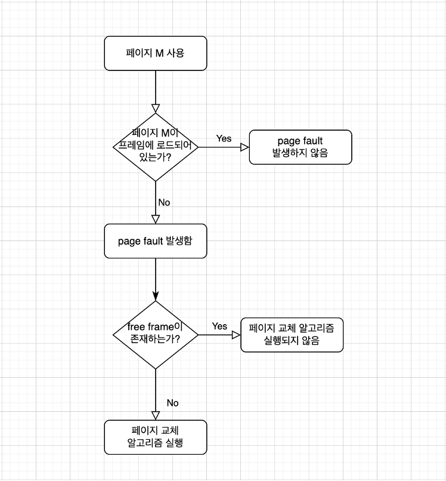
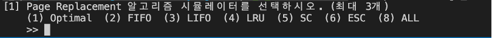
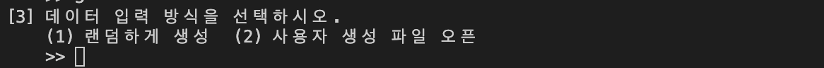
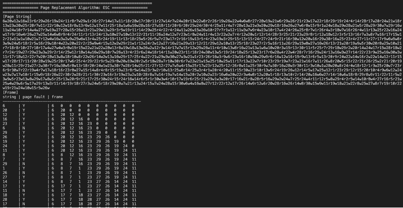
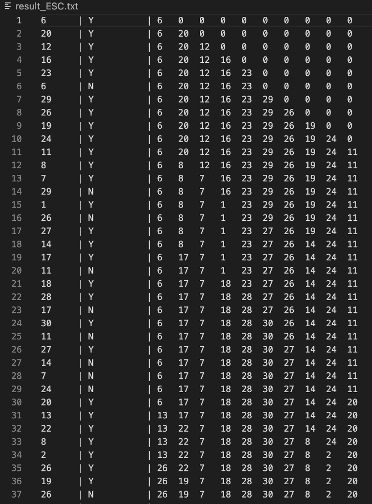

# [과제 4] Page Replacement Simulator

> 목표

- Page Replacement Algorithms 동작 방식 이해

 

> 세부사항

- 페이지 교체 알고리즘을 C언어로 프로그래밍 작성
    - Optimal
    - FIFO(First In First Out)
    - LIFO(Last In First Out)
    - LRU(Least Recently Used)
    - LFU(Least Frequently Used)
    - SC(Second Chance)
    - ESC(Enhanced Second Chance)
- 시스템에서 자동 입력과 사용자 (파일) 입력을 사용하여, 각 페이지 교체 알고리즘에 대한 page fault 횟수 측정 및 Optimal 알고리즘과 비교

 

> 제약 조건

- 각 reference page stream 번호는 1부터 30까지 존재
- reference page stream을 입력 받는 방식
    - 프로그램이 수행될 때 마다 프로그램 내부에서 자동으로 생성하는 방법
    - 파일로 입력받는 방법
- page string 개수는 1000개
- frame 개수는 사용자 입력 값으로 설정 (3개 ~ 10개)
- 시뮬레이션 결과는 표준 출력이 되고, 동시에 파일로도 저장
- ESC 알고리즘의 경우 페이지 스트링에 R/W 비트가 함께 표시되어야 함

 
 

## 구현 기본 사항

> Page Replacement Algorithm들의 전반적인 흐름도

- Free frame이 존재하는 경우 낮은 인덱스의 frame부터 채워 나감
- 동일한 교체 조건을 가지는 페이지가 있는 경우 낮은 인덱스에 위치한 페이지부터 교체함

 

> 파일 구성

- Makefile
    - 기능 별로 분리해 둔 파일들을 바탕으로 하나의 실행 파일인 replacementPage_exe 생성
    - [source](./Makefile)
- main.c
    - 해당 프로그램의 main 함수
    - [source](./main.c)
- input.c
    - 사용자에게 값을 입력 받는 함수들을 모아둔 파일
    - [source](./input.c)
- page.c
    - page 생성 및 출력 등의 page와 관련된 정보들을 모아둔 파일
    - [source](./page.c)
- replacement.c
    - page replacement algorithm을 구현해둔 파일
    - [source](./replacement.c)
- makeUserFile.c
    - 랜덤 함수를 이용해 page string을 파일(user_page_string, user_page_string_ESC)에 저장
    - 미리 컴파일을 통해 파일에 page string 값을 저장해두었기 때문에 Make 시, 컴파일되지 않음
    - [source](./makeUserFile.c)

 

> UI

- 아무 것도 입력되지 않는 경우는 없다고 가정
- 마지막 값이 들어온 이후에는 더 이상 공백이 입력되지 않는다고 가정
- 알고리즘 시뮬레이터 선택 화면
    
    
    - 알고리즘 선택 개수가 3개가 초과하는 경우 다시 값을 입력 받도록 함
    - 주어진 보기 외의 다른 값이 입력된 경우 다시 값을 입력 받도록 함
    - 중복되는 값의 입력을 허용함
    - (8)All 은 단독으로만 입력되도록 함
- 페이지 프레임 개수 선택
    
    
    - 허용 범위인 3 ~ 10을 벗어난 값이 입력된 경우 다시 값을 입력 받도록 함
- 페이지 스트링 입력 방식 선택
    
    
    - (1)랜덤하게 생성: 프로그램이 실행될 때마다 랜덤함수를 통해 프로그램 내부에서 페이지 스트링 생성
    - (2)사용자 생성 파일 오픈: 미리 생성해둔 페이지 스트링 파일 오픈하여 입력
    - 주어진 보기 외의 다른 값이 입력된 경우 다시 값을 입력 받도록 함

 

> 결과 출력

- 각각의 알고리즘 수행 결과 값은 표준 출력과 동시에 파일에 저장함
- 표준 출력

    
    - 각각의 알고리즘에서 입력된 page string
    - 입력된 string 값
    - page fault 발생 여부
    - page string 값이 입력될 때마다 달라지는 frame 모습
- 파일 저장

    
    - 파일명은 result_[알고리즘명].txt로 설정
    - 입력된 string 값
    - page fault 발생 여부
    - page string 값이 입력될 때마다 달라지는 frame 모습

 
 

## Page Replacement Algorithms

> Optimal
- victim: 가장 오래동안 안쓰일 페이지
- 현실에서는 미래를 알 수 없기 때문에 구현 불가능
- 본 과제에서는 다음에 들어올 page string 값을 알 수 있기 때문에 구현 가능
- 가장 이상적인 페이지 교체 알고리즘

 

> FIFO (First In First Out)
- victim: 메모리에 가장 오래 있었던 페이지
- 알고리즘으로 구현하기는 쉽지만 성능이 좋지 않음
- page table 구조체에 메모리가 load되는 시점을 저장하는 input_time 추가
- input_time 값이 가장 작은 페이지를 victim으로 선정

 

> LIFO (Last In First Out)
- victim: 메모리에 가장 짧게 있었던 페이지
- 알고리즘으로 구현하기는 쉽지만 성능이 좋지 않음
- page table 구조체에 메모리가 load되는 시점을 저장하는 input_time 추가
- input_time 값이 가장 큰 페이지를 victim으로 선정

 

> LRU (Least Recently Used)
- victim: 가장 오래동안 참조하지 않은 페이지
- Optiaml 알고리즘과 가장 근접한 알고리즘이지만 실제 구현은 거의 불가능
- page table 구조체에 페이지가 마지막에 참조되었던 시점을 저장하는 ref_time 추가
- ref_time 값이 가장 작은 페이지를 victim으로 선정

 

> LFU (Least Frequently Used)
- victim: 참조 횟수가 가장 적은 페이지
- 오래 전에 여러 번 접근한 page더라도 참조 횟수가 높아 교체되지 않는 경우 발생함
- page table 구조체에 페이지가 참조된 횟수를 저장하는 ref_cnt 추가
- ref_cnt 값이 가장 작은 페이지를 victime으로 선정

 

> SC (Second Chance)
- victim: R-bit가 0인 페이지
- R-bit가 1인 경우 이를 0으로 바꾸고 넘어감 즉, 페이지에게 한 번의 기회를 더 주는 알고리즘
- page table 구조체에 R-bit 값을 저장하는 r-bit 추가

 

> ESC (Enhanced Second Chance)
- victim: R-bit와 W-bit 값을 기준으로 우선순위를 세워 우선순위가 가장 높은 페이지
- 우선순위(R, W): (0, 0) -> (0, 1) -> (1, 0) -> (1, 1)
- (1, 1)까지 검사가 끝나면 다시 (0, 0)부터 검사하여 victim 선정
